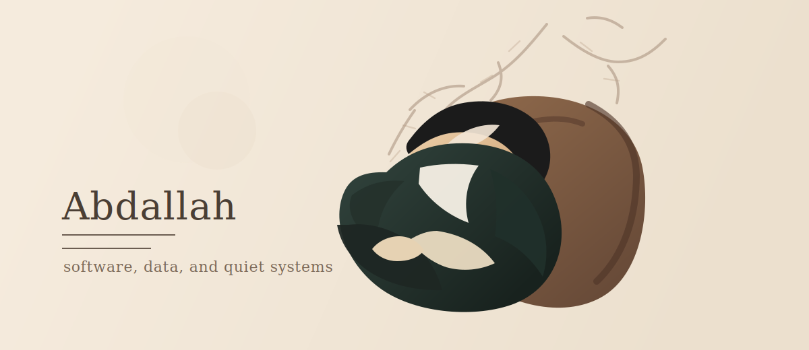

  

<h1 align="center">Abdallah</h1>

  Software Engineer in progress, currently finishing a Math and Computer Science degree and shaping the next chapter around applied AI, product engineering, and systems that feel precise and durable.

  <a href="mailto:abdallah.titt@gmail.com">abdallah.titt@gmail.com</a>

## About

I like building software with a calm surface and a serious backbone.
Most of what I work on sits somewhere between product engineering, data, and infrastructure: mobile experiences, AI-assisted systems, backend design, automation, and self-hosted tooling.

Right now, I am polishing the pieces that define the next step: my CV, my master applications, my portfolio, and the public face of my work.

## What I am building

**Fight Learn**  
Leading the product and engineering direction of an EdTech mobile app for combat sports, with computer vision and pose estimation used to help users practice movement with real feedback.

**Sparkly Service**  
Building a B2B marketplace with a focus on clean backend flows, payments, and operational automation.

**Homelab**  
Running a personal server environment with Docker and CasaOS to keep a direct relationship with deployment, observability, and day-to-day systems work.

## Focus areas

- Applied AI for real product use cases
- Backend and API design
- Data-centric product thinking
- DevOps, containers, and self-hosted infrastructure
- Building tools that stay understandable as they scale

## Selected GitHub Signals

  

  
  

## Working style

I am drawn to projects that need both clarity and depth: the kind of work where architecture matters, details matter, and the final result should feel quieter than the effort required to build it.

## Stack, in plain terms

Python, Java, TypeScript, SQL, and C when needed.
Docker, Supabase, Firebase, automation workflows, and cloud tooling when the system calls for them.

## Notes

The metrics cards in this profile are generated with [lowlighter/metrics](https://github.com/lowlighter/metrics) through GitHub Actions.
To enable automatic updates, add a repository secret named `METRICS_TOKEN` with a GitHub personal access token.
